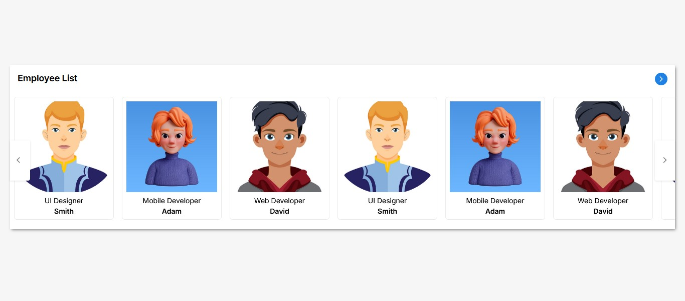

## Card Slider in React

A card slider built with React. This slider allows you to showcase content in a carousel format with smooth sliding transitions.Built with **React**,**css** and **Javascript**.

## Features

- **Smooth sliding animations**: Cards slide left and right with ease.
- **Custom controls**: Navigate through the cards with next/previous buttons.
- **Drag-to-Navigate**: Users can drag cards to the left or right to navigate through them.

## Preview



## Installation

To use the card slider in React project:

1. Clone the repository:

   ```bash
   git clone https://github.com/rupeshpatil27/React-CardSlider.git
   ```

2. Navigate to the project folder:

   ```bash
   cd React-CardSlider
   ```

3. Install the dependencies using npm or yarn:

   ```bash
   npm install
   ```

### Example of usage in a React app:

1. Create a custom component that contains the card slider.

   ```jsx
   import React, { useRef, useState } from "react";
   import "./CardSlider.css";

   import { MdArrowForwardIos, MdArrowBackIos } from "react-icons/md";

   const CardSlider = ({
     cardSliderTitle = "",
     data = null,
     isButtonVisible = false,
     isDraggable = false,
   }) => {
     let cardList = useRef(null);
     let isDragging = false;
     let startX, startScrollLeft;

     const [isLeftScroll, setIsLeftScroll] = useState(false);
     const [isRightScroll, setIsRightScroll] = useState(true);

     const dragStart = (e) => {
       if (!isDraggable) return;
       isDragging = true;
       cardList.current.classList.add("dragging");
       startX = e.pageX;
       startScrollLeft = cardList.current.scrollLeft;
     };

     const dragging = (e) => {
       if (!isDraggable) return;
       if (isDragging) {
         cardList.current.scrollLeft = startScrollLeft - (e.pageX - startX);
       }
     };

     const dragStop = (e) => {
       if (!isDraggable) return;
       isDragging = false;
       cardList.current.classList.remove("dragging");
     };

     const slideProducts = (type) => {
       const firstCardWidth = cardList.current.children[0].offsetWidth;
       cardList.current.scrollLeft +=
         type === "left" ? -firstCardWidth : firstCardWidth;
     };

     const handleSlideButton = () => {
       if (!isButtonVisible) return;

       setIsLeftScroll(cardList.current.scrollLeft <= 0 ? false : true);

       setIsRightScroll(
         cardList.current.scrollLeft >= cardList.current.scrollLeftMax
           ? false
           : true
       );
     };

     return (
       <div className="card-slider">
         <div className="card-container">
           <a className="card-header">
             <div className="header-title">{cardSliderTitle}</div>
             <div className="header-btn">
               <MdArrowForwardIos className="icon" />
             </div>
           </a>

           <div className="card-body">
             <div
               className="card-list"
               ref={cardList}
               onMouseDown={dragStart}
               onMouseMove={dragging}
               onMouseUp={dragStop}
               onMouseLeave={dragStop}
               onScroll={handleSlideButton}
             >
               {data.map((item, index) => (
                 <div className="card-wrapper" key={index}>
                   <div className="card">
                     <div className="image">
                       
                     </div>
                     <div className="info">
                       <span className="title">{item.title}</span>
                       <span className="name">{item.name}</span>
                     </div>
                   </div>
                 </div>
               ))}
             </div>

             {isButtonVisible && (
               <>
                 {isLeftScroll && (
                   <button
                     className="slider-btn left"
                     id="left"
                     onClick={() => slideProducts("left")}
                   >
                     <MdArrowBackIos className="icon" />
                   </button>
                 )}

                 {isRightScroll && (
                   <button
                     className="slider-btn right"
                     id="right"
                     onClick={() => slideProducts("right")}
                   >
                     <MdArrowForwardIos className="icon" />
                   </button>
                 )}
               </>
             )}
           </div>
         </div>
       </div>
     );
   };

   export default CardSlider;
   ```

## Props

The `CardSlider` component accepts the following props:

- **`cardSliderTitle`** (String, required): Set Card Slider title.

- **`data`** (Array, required): An array of card objects. Each object must have an `title`, `name`, and `img` (or other fields you need).

  Example:

  ```jsx
  Data={[
    {
    title: "Web Developer",
    name: "David",
    img: "[image]",
  },
  {
    title: "UI Designer",
    name: "Smith",
    img: "[image]",
  },
  {
    title: "Mobile Developer",
    name: "Adam",
    img: "[image]",
  },
  ]}
  ```

- **`isButtonVisible`** (Boolean, default: `false`): Set to `true` to show buttons and navigate through the cards.

- **`isDraggable`** (Boolean, default: `false`): Set to `true` to enable the drag-to-navigate functionality.

## Example

Here's a complete example of using the card slider:

```jsx
import "./App.css";

import img1 from "./assets/img1.jpg";
import img2 from "./assets/img2.jpg";
import img3 from "./assets/img3.jpg";

import CardSlider from "./component/CardSlider/CardSlider";

function App() {
  const Data = [
    {
      title: "Web Developer",
      name: "David",
      img: img1,
    },
    {
      title: "UI Designer",
      name: "Smith",
      img: img2,
    },
    {
      title: "Mobile Developer",
      name: "Adam",
      img: img3,
    },
    {
      title: "Web Developer",
      name: "David",
      img: img1,
    },
    {
      title: "UI Designer",
      name: "Smith",
      img: img2,
    },
    {
      title: "Mobile Developer",
      name: "Adam",
      img: img3,
    },
    {
      title: "Web Developer",
      name: "David",
      img: img1,
    },
    {
      title: "UI Designer",
      name: "Smith",
      img: img2,
    },
    {
      title: "Mobile Developer",
      name: "Adam",
      img: img3,
    },
  ];

  return (
    <div className="main-container">
      <CardSlider
        cardSliderTitle="Employee List"
        data={Data}
        isButtonVisible={true}
        isDraggable={true}
      />
    </div>
  );
}

export default App;
```
